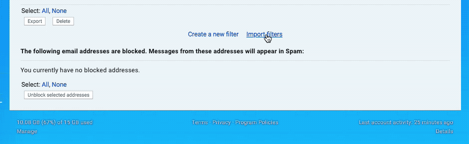

# GMB Gmail filters
## Tame your inbox with these Gmail mail filters for Google My Business
If you manage a LOT of client locations in GMB the emails will quickly get out of hand. These filters will help keep your inbox under control without having to unsubscribe completely from GMB's emails.

1. Download the rules export file [here](https://github.com/JayHoltslander/gmb-gmail-filters/raw/master/mailFilters.xml).
2. Open Gmail, go to Settings/[Filters](https://mail.google.com/mail/?tab=wm#settings/filters)
3. Import the .xml file as shown in the gif below.

